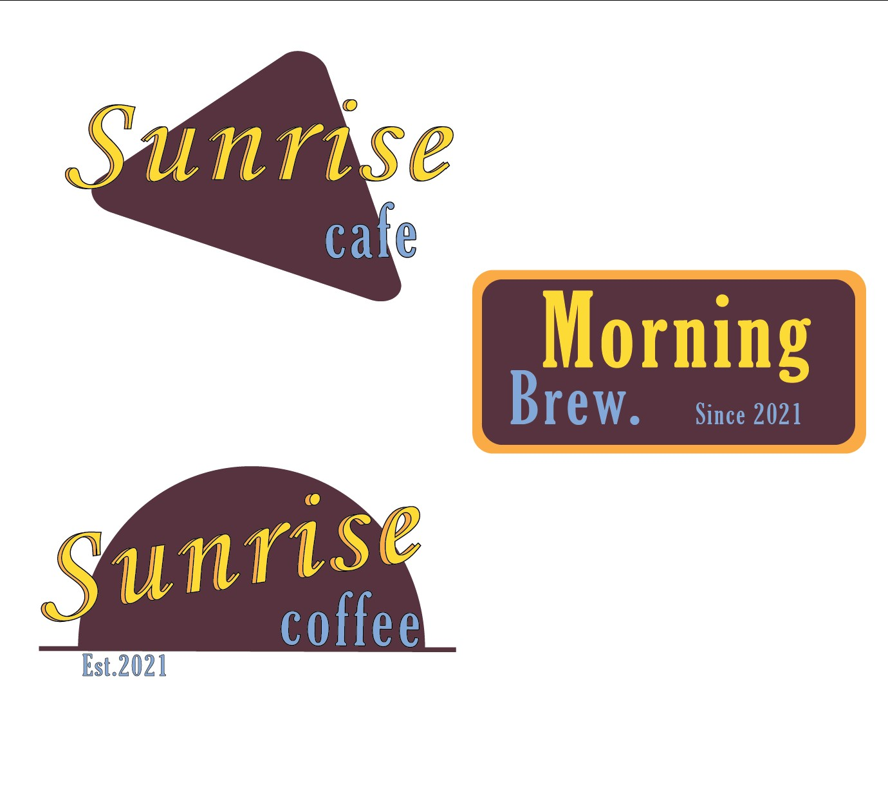
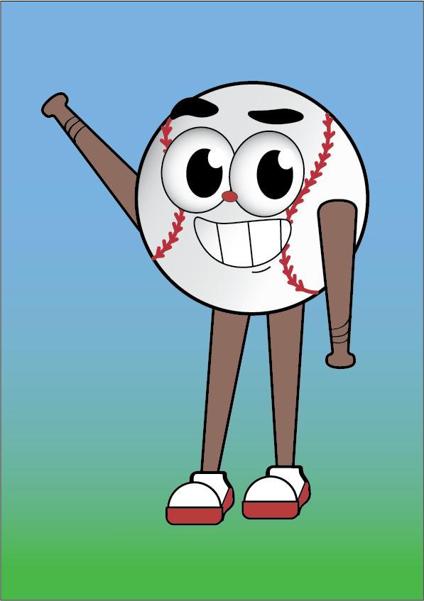

<!-- Main -->

 <!-- One -->
    <section id="one">
	  

		  <header class="major">
			  <h1>Artworks</h1>
		  </header>

<!--Content-->
      

 Here are some of my recent digital creations that were made using Adobe Illustrator. 
These designs are usually simple and serve simply as a way for me to express my creativity.
Check back over the folowing months to watch this library grow! 

<!-- plain gallary -->

        

          

          

          

      

          

          

         

