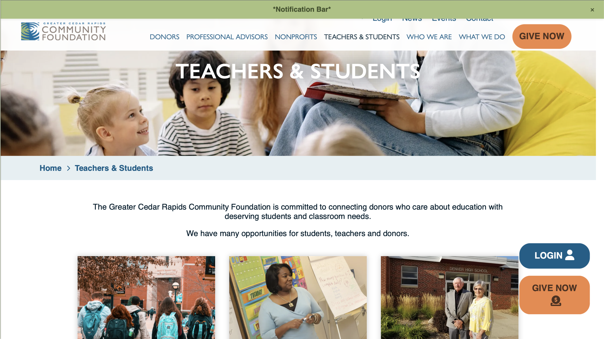
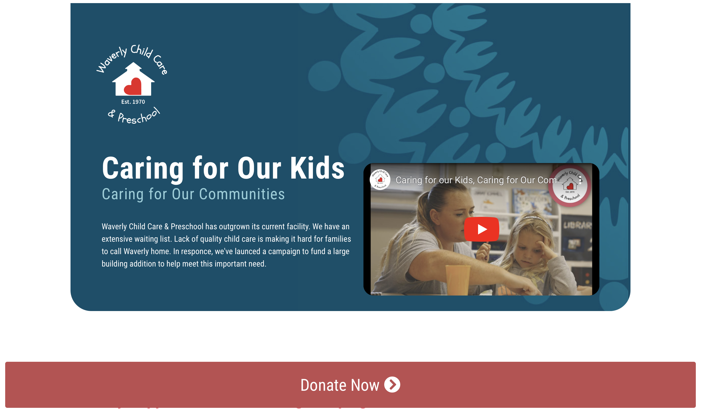
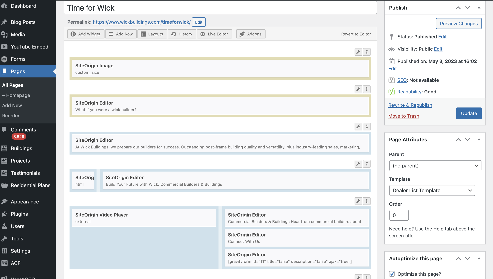
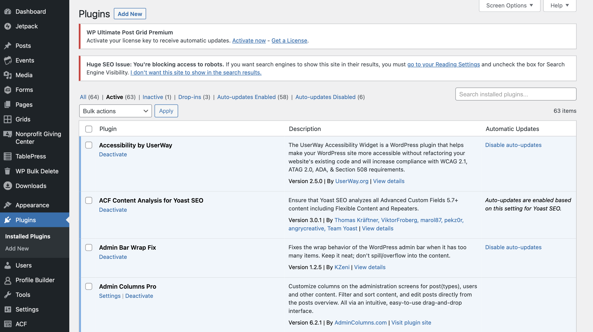

<!-- Main -->

<!-- One -->
<section id="one">
	

		<header class="major">
			<h1>Resume</h1>
		</header>

<!-- Break -->

<a href="assets/files/myresume.pdf" download="ChaviParks_resume" class="button icon fa-download">Download</a> 

<h3>Web developer internship </h3>
<blockquote>Executive summary that explains internship and provides enough information to allow the portfolio to stand alone with the reader. This is an overview of your major accomplishments that are marketable to an employer, rather than an exhaustive run-down of every little thing you did during the internship. It should be part bullet-point list, part narrative. The idea is that a busy executive can read it quickly and get a good understanding of your experience. </blockquote>

 In my initial weeks of website development I was responsible for quality assurance on a client's website. I utilized Trello to track and manage identified issues, systematically working to debug layout issues and integrate content supplied by the client.

 

 My first design project was working with<a href="https://waverlychildcare.org/caring-for-our-kids/">Waverly childcare</a>. I was tasked with creating a landing page using the Seed Prod website theme builder. My main objective was to bring the client's vision to life while adhering closely to the approved design, ensuring that the resulting landing page was both functional and visually appealing across both desktop and mobile platforms.

 

 Presented here is an example of another webpage I built, this time using SiteOrigin. The webpage, which you can access <a href="https://www.wickbuildings.com/timeforwick/">here</a>, required the creation of new assets that aligned with the client's design specifications. To achieve this, I utilized various tools, including the provided software, Photoshop, and CSS, resulting in a successful outcome that met the client's desired vision. The image displayed shows the webpages's backend, demonstrating my ability to create a webpage from start to finish.

 

As I learned during my internship, securing a website is a crucial aspect of its success, as important as creating a great design. In my role, I worked on various client sites to install and update plugins that were responsible for enhancing website security and optimizing website performance. This was done with the aim of ensuring that only authorized personnel had access to the backend of client sites, and to provide our clients with peace of mind knowing that their websites were secure. Furthermore, we provided our clients with tools to analyze user data and improve their website's user experience (UX), emphasizing our commitment to enhancing both security and functionality.

